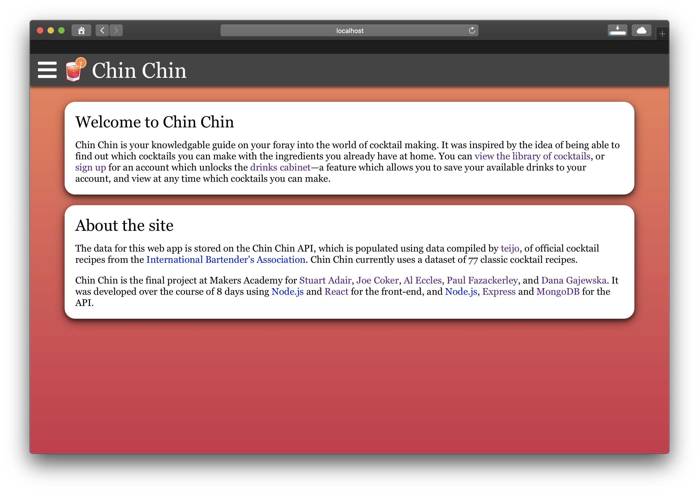
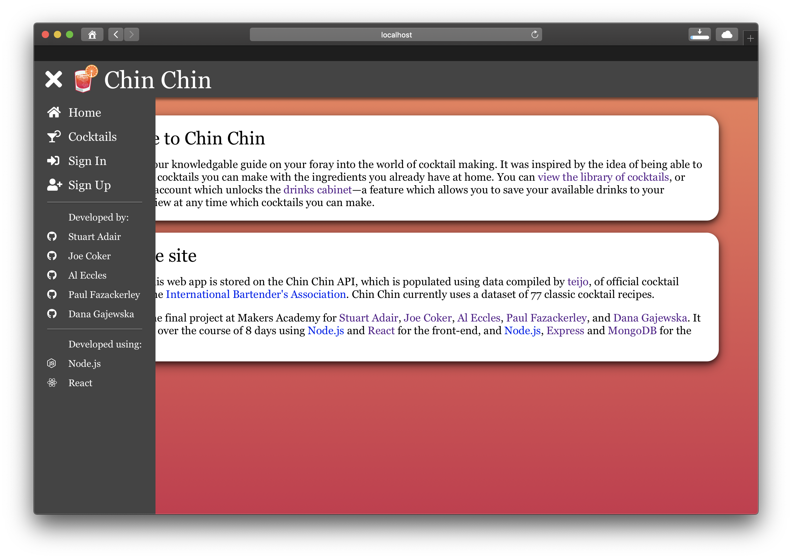
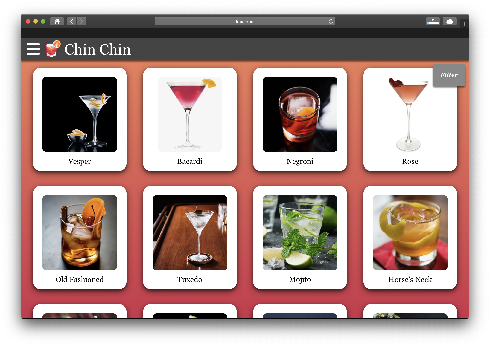
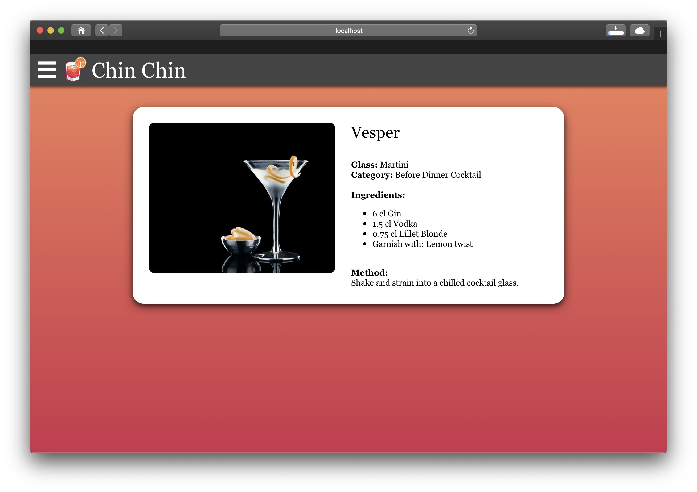
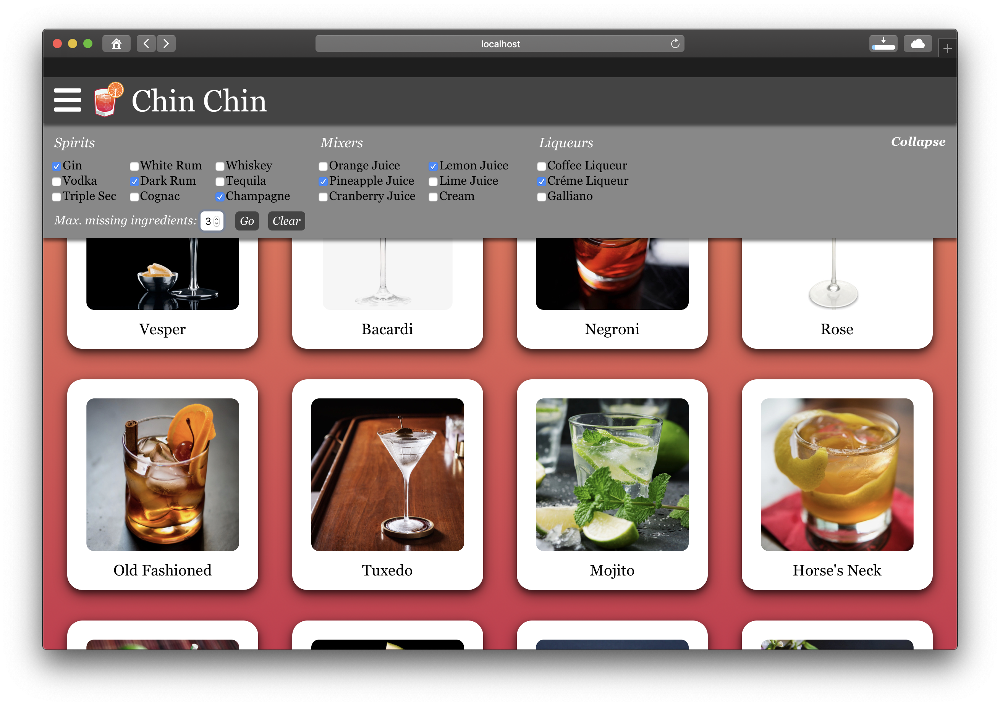
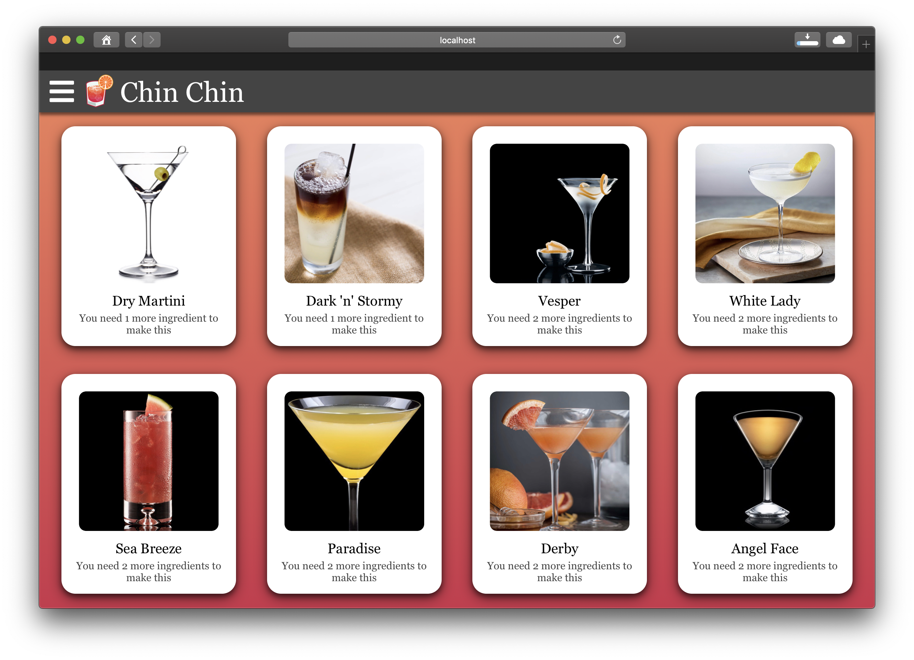
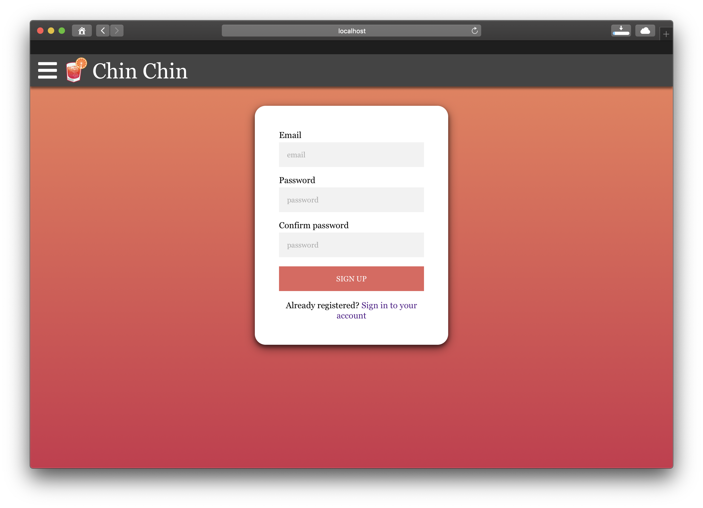
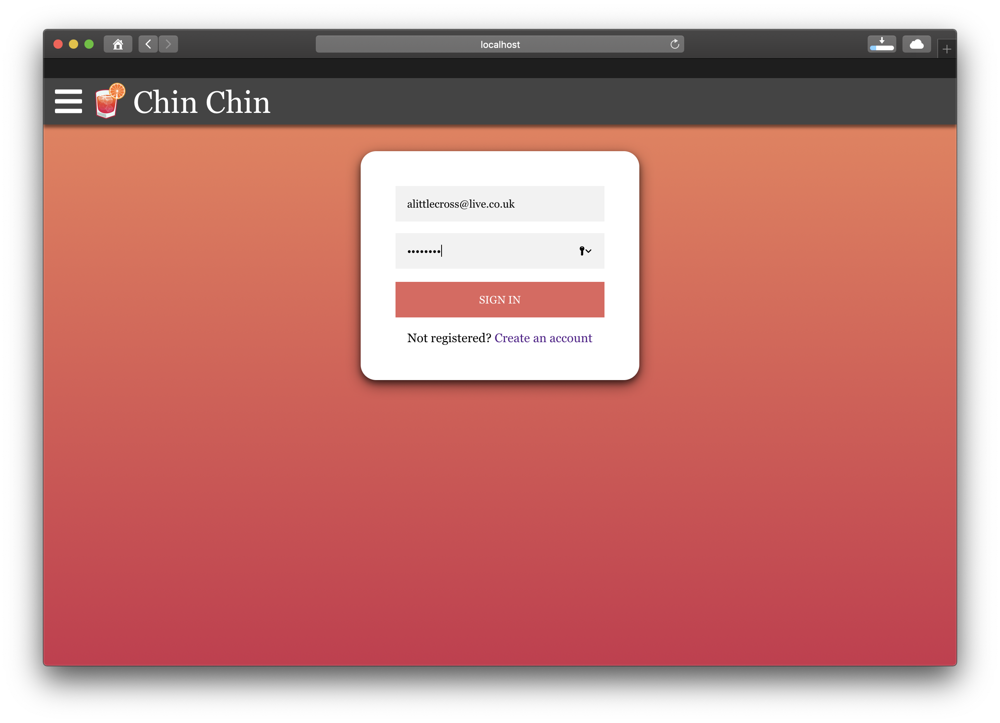
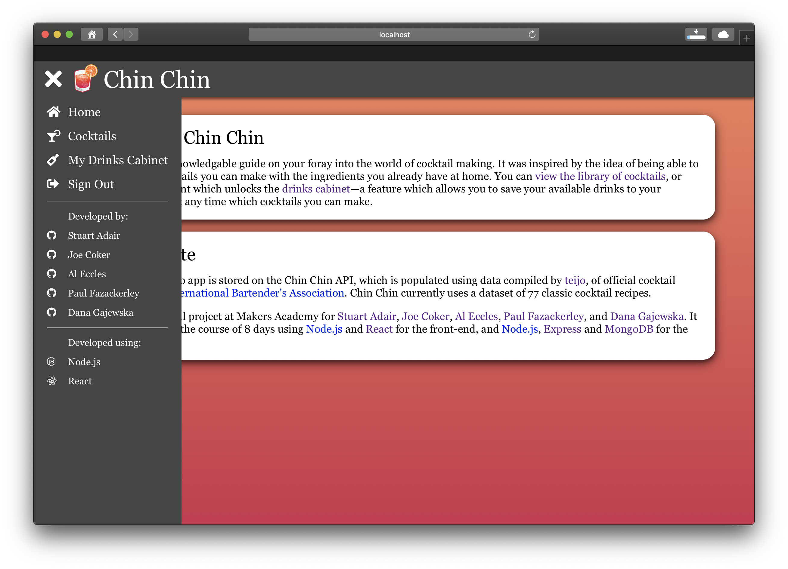
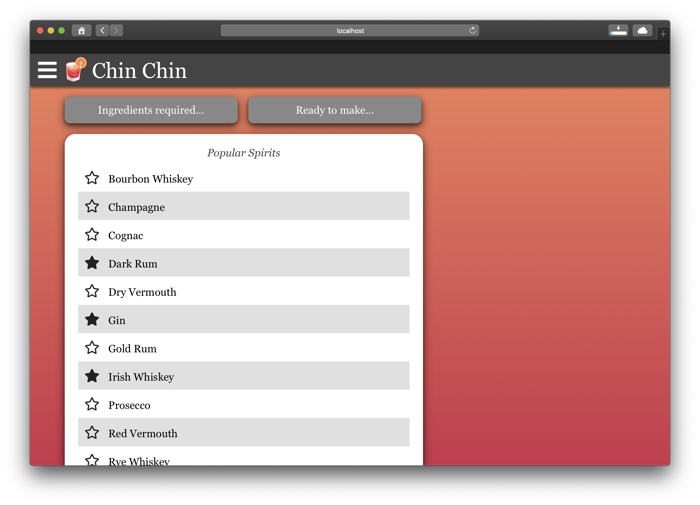

# ChinChinReactApplication

Chin Chin is your knowledgable guide on your foray into the world of cocktail making. It was inspired by the idea of being able to find out which cocktails you can make with the ingredients you already have at home. You can <Link to='/cocktails/all'>view the library of cocktails</Link>, or <Link to='/sign-up'>sign up</Link> for an account which unlocks the <Link to='/drinks-cabinet'>drinks cabinet</Link>&mdash;a feature which allows you to save your available drinks to your account, and view at any time which cocktails you can make.

The data for this web app is stored on the Chin Chin API, which is populated using data compiled by <a href='https://github.com/teijo/iba-cocktails'>teijo</a>, of official cocktail recipes from the <a href='http://iba-world.com/'>International Bartender's Association</a>. Chin Chin currently uses a dataset of 77 classic cocktail recipes.

Chin Chin is the final project at Makers Academy for <a href='https://github.com/StuAA78'>Stuart Adair</a>, <a href='https://github.com/joecoker'>Joe Coker</a>, <a href='https://github.com/Vaent'>Al Eccles</a>, <a href='https://github.com/alittlecross'>Paul Fazackerley</a>, and <a href='https://github.com/DGajewska'>Dana Gajewska</a>. It was developed over the course of 8 days using <a href='https://nodejs.org/'>Node.js</a> and <a href='https://reactjs.org/'>React</a> for the front-end, and <a href='https://nodejs.org/'>Node.js</a>, <a href='https://expressjs.com/'>Express</a> and <a href='https://www.mongodb.com/'>MongoDB</a> for the API.

## Getting started

The app is hosted on Firebase here: https://chin-chin-chin.firebaseapp.com

To run the app locally, in the location of your choice:

`git clone git@github.com:joecoker/ChinChinReactApplication.git`

Then `cd` into that directory.

Assuming you have Node.js and NPM installed, in that same location, in Terminal:

`npm install`

## Local Usage

In that same location, in Terminal:

`npm start`

React should open the page in your browser automatically; if not you can view the page at either of the IP addresses React provides in the Terminal window.

The user should be welcomed with the home page:

